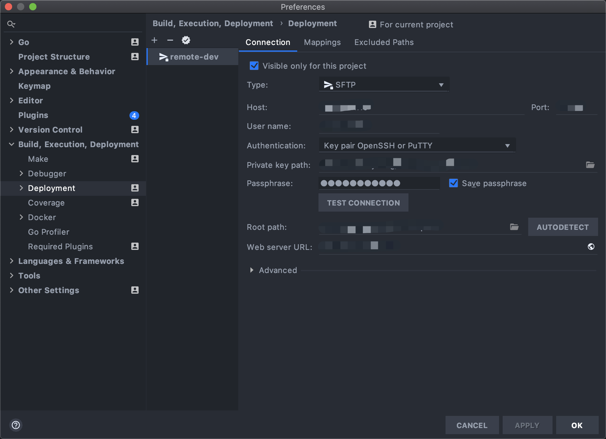
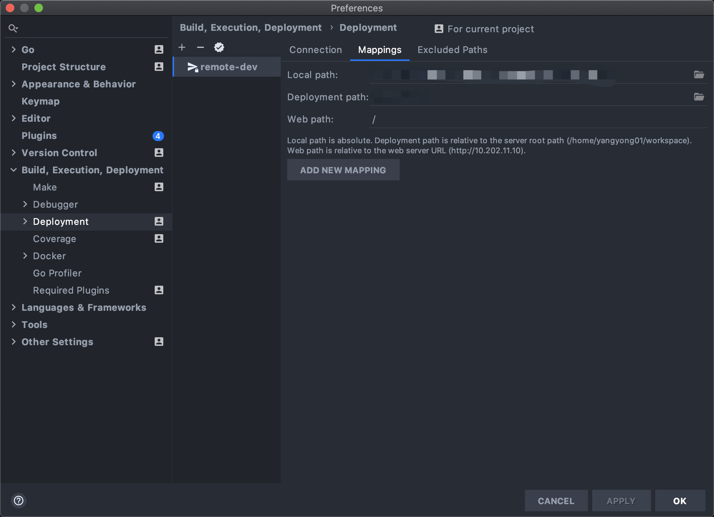
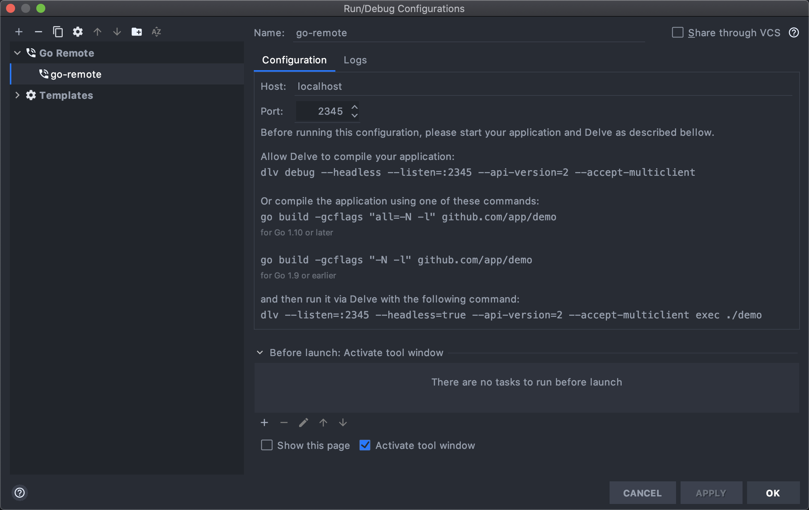

# 如何对 go 进行远程调试

有时候因为外网无法访问内网的网络，不得已只能将代码跑在远程机器上，但是直接跑的话就没法调试。

本文是基于 Goland IDE 工具和 delve 进行远程调试的开发环境的配置。分为以下几个步骤：

1. [Goland 上配置远程机器的部署环境](#1-goland-上配置远程机器的部署环境)
2. [Goland 上添加调试配置](#2-goland-上添加调试配置)
3. [ssh 配置](#3-ssh-配置)
4. [在远程机器上安装 delve](#4-在远程机器上安装-delve)
5. [进行远程调试](#5-进行远程调试)

## 1. Goland 上配置远程机器的部署环境

在 Goland 中的 Preferences -> Deployment 中创建一个远程连接，如下所示：


**Root path** 可以选择远程机器的工作区，其他的配置就按照如何连接远程机器的方式来配置就行了。

接着要配置映射到远程机器的目录文件，如图所示：


**Local path** 选择当前的项目目录路径，**Deployment path** 选择远程机器的项目目录路径。两者都可以通过右边的文件夹图标来自动填补。

## 2. Goland 上添加调试配置

添加一个 remote-dev 配置项，默认的 Host 和 Port，如图所示：


后续就要在远程机器上部署 delve 来进行调试了。

## 3. ssh 配置

远程机器需要配置用户名、密钥等信息才能够访问，而且要进行远程调试，还需要进行端口转发。以下有两种方式来建立连接：
1. [通过命令行添加参数来访问](#通过命令行添加参数来访问)
2. [通过配置文件来访问](#通过配置文件来访问)

比如，现在有台测试机的信息如下：
- ip
- port
- username
- passphrass
- id_rsa

#### 通过命令行添加参数来访问
   
输入以下命令，然后输入 `passphrass` 登入远程机器：
```shell
ssh -i /path/of/private_key username@ip_address -p port -o ServerAliveInterval=60 -t 'source ~/.bashrc;bash'
```
后面的 `-t 'source ~/.bashrc;bash'` 是进入远程机器后执行的命令。加上 `;bash` 是为了防止执行后退出终端。

#### 通过配置文件来访问
   
首先编辑 ssh 的配置文件:
```shell
vim ~/.ssh/config
```

配置文件的模板如下：
```vim
# myhostname
Host myhostname
  HostName ip_address
  Port port
  User username
  IdentityFile /path/of/private_key
  PreferredAuthentications publickey
  ServerAliveInterval 60
  RemoteCommand source ~/.bashrc;bash
  # 启动伪终端模式
  RequestTTY force
  # delve 端口转发
  LocalForward 0.0.0.0:2345 127.0.0.1:2345 
  LocalForward ... # other_forward
```

然后执行以下命令，输入 `passphrass` 访问远程机器
```shell
ssh myhostname
```

## 4. 在远程机器上安装 delve

安装教程：https://github.com/go-delve/delve

在远程机器的项目的程序目录中（非项目根目录）执行：
```shell
dlv debug --headless --listen=:2345 --api-version=2 --wd=./../..
```

其中 `--wd` 看情况要配置到项目的根目录中。

启动 `:2345` 端口后就可以用 Goland 进行远程调试了.

### 5. 进行远程调试

远程机器启动 `devel` 后，Goland 上选择已经配置好的 [remote-dev](#2-goland-上添加调试配置) 调试配置，然后按下 debug 按钮，就可以进行远程调试了。

